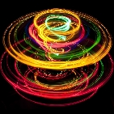

<p align="center">
<a href="https://github.com/invider/collider.jam">

</a></p>

Welcome to Collider.JAM!
========================

<p align="right">
    <i><b>The Fun of the Game Jamming.</b></i>
</p>

Collider.JAM is a JavaScript framework for rapid game prototyping and jamming.
It was crafted from experience of multiple game jams we've participated in.

Game prototyping is an art that mixes design, technology and creativity
bounded by time or other limitations.
And we believe it deserves a dedicated tool to address specific needs of a rapidly evolving and changing prototype.

Check out tutorials and code examples below.
_And pixelate reality!_

Table of Contents
-----------------
* [Install](#install)
* [Drawing Shape](#drawing-shape)
* [Flying Saucer](#flying-saucer)
* [Spaceship](#spaceship)
* [Jam Mixes](#jam-mixes)
* [Explore](#explore)
* [Tutorials](#tutorials)
* [How To](man/HowTo.md)
* [Examples](#examples)
* [Jamming Games](#jamming-games)
* [How to Contribute](#how-to-contribute)


Install
-------

To start jamming, we need to install collider.jam npm package.
It provides the sheel to bootstrap and run game projects.

Make sure you have the latest Node.js installed
by running in the console:

```bash
node --version
```

If it is something like 12.16+, you are OK:
```
> v12.16.1
```

If not, visit [Node.js](https://nodejs.org) for installation
instructions and package.

---
Now, to install collider.jam, run:

```
npm install -g collider.jam
```

Or to use the latest development version, install directly from GitHub:
```
npm install -g https://github.com/invider/collider.jam.git#develop
```

When installed, check _version_ and _help_:
```
jam version
jam help
```


Drawing Shape
-------------
Select a folder to keep your game projects in
and create a new subfolder named 'cirlce.mod':
```
mkdir circle.mod
```

The *.mod* extension is crucial here,
since that is how **Collider.JAM** determines
the root of the project.
**Collider.JAM** has particular conventions
on how you name and organize files and directories.

It could be unusual first, but makes a lot of sense
once you get into the jamming mode.

Create a file *circle.mod/lab.js* and fill in the following lines:

```js
function draw() {
    lineWidth(2)         // set the line width
    stroke(.12, .4, .5)  // color in float HSL
    circle(200, 200, 50) // draw the circle
}
```

Now, just run 'jam play' command while in *circle.mod* folder.

```
jam play
```

Collider.JAM will start a server and open default browser
pointing at *[http://localhost:9999]*.


Moving Shape
------------

Let's make some movement by introducing
variables for the circle position and direction.
We also will need the *evo(dt)* function to move it:

```js
// position at the center of the screen
let x = rx(.5)
let y = ry(.5)
let r = 50

// the speed along x and y axises
let dx = 100
let dy = 100

function evo(dt) {
    // make the movement relative to the time passed
    x += dx * dt
    y += dy * dt
}

function draw() {
    background('#101010') // color in hex RGB
    lineWidth(2)
    stroke(.12, .4, .5)   // color in float HSL
    circle(x, y, r)
}
```

Notice the background() function
in the beginning of draw().
Since we are moving the cirlce now,
the background needs to be refilled
to clean up the previous frame.

The problem is that the circle dissapears
once it crossed the edge of the screen.

We can introduce some boundaries on x and y,
so our evo(dt) would look like this:
```js
function evo(dt) {
    // make the movement relative to the time passed
    x += dx * dt
    y += dy * dt

    // screen edge boundaries
    if (x > rx(1)-r && dx > 0) dx *= -1
    else if (x < r && dx < 0) dx *= -1
    if (y > ry(1)-r && dy > 0) dy *= -1
    else if (y < r && dy < 0) dy *= -1
}
```

Find the working example on [GitHub](https://github.com/invider/bits.mix/tree/master/circle.mod).


Prototyping in Development Mode
-------------------------------

The most rudimental *Collider.JAM* command is *jam*:

```
jam
```

It just runs the jam server without opening a web browser,
as *jam play* does.

But it is more convenient to run in development mode
while developing:

```
jam -d
```

That enables code hot reload and help metadata
among other things.

Run *Collider.JAM* with -d option,
open browser at http://localhost:9999
and try to change circle color or radius.

The changes will be applied in the browser
after you saved lib.js.


Drop Resource
-------------
Let's spice up our bouncing circle a little.

Find a suitable image of a planet with transparent background,
just like this one from OpenGameArt:
https://opengameart.org/sites/default/files/mars_type_planet.png

Download and drop it into *circle.mod/res/* folder.

Now change the draw() function to the following:

```js
function draw() {
    background('#000000')
    lineWidth(5)
    stroke(.58, .5, .7)
    circle(x, y, r)
    image(res.mars_type_planet, x-r, y-r, 2*r, 2*r)
}
```

We've changed the background to totally black,
to match the darkness of space.
Then, we've added the image function to draw the planet texture. Notice, that the image name must match
the file name without the extension.

In this example we've left the circle
and tune it width and color to resemble
the planet's atmosphere.

Check out working example on [GitHub](https://github.com/invider/bits.mix/tree/master/planet.mod).


Flying Saucer
-------------

It is time to have something moving on the screen!

Open console in your jam projects folder.

Make new project directory:
```
mkdir test-saucer
cd test-saucer
```

Init the project and patch it with saucer:
```
jam init default
jam patch saucer
```

Now run it:
```
jam play
```

The browser should open a window with a saucer.

----

Now explore the app structure:

```
/mod
  +-/lab
      |- background.js - prop with Z = 0 that draws background
      |- saucer.js - the saucer object with evo() and draw() functions
                     this particular file was added by saucer patch
```

Everything placed in /mod/lab will be spawned into an entity on the scene.
An object is exposed by assigning it to module.exports

It is super simple to create something from scratch
(not from existing patch, as we've created the saucer).
Just place js and resource files in the right places.


Spaceship
---------

Let's create a project from an empty mod,
to see how it all comes together.

### collider.jam project init

Get back to your project dir and create a new subdirectory:
```
mkdir test-ship
cd test-ship
```

Now we are bootstraping it from an empty mod:
```
jam init empty
```

It has created _./pub/index.html_ which already contains
collider.jam core script.
_./mod_ has also been created with empty res, dna and lib subdirectories.

### assets

Our ship should look somehow,
so go and place an image file _ship.png_
in _./res_ directory.

It will be loaded automatically for you,
just like anything else.

### background

We need a background to fill the scenery.

Create _./lab/background.js_:
```
module.exports = {

    // we want the background to be behind everything else,
    // hence the 0 value for Z
    Z: 0,

    draw: function() {
        // draw a solid rectangle filling the whole screen
        ctx.fillStyle = '#151220'
        ctx.fillRect(0, 0, ctx.width, ctx.height)
    }
}
```
We use the standard js canvas 2d context
to fill a dark rectangle.

Notice, that ctx is already in scope.
It is one of the magic tricks of collider.jam.


When specified, the lab frame uses Z to place nodes
according to their Z-value.
We've selected 0 as a background layer just for convenience.
Actually we can use any arbitrary numbers
(e.g. 1001 for the background, 1011 for sprites).

### the ship

Now create _./lab/ship.js_
```
module.exports = {
    Z: 1,

    // place ship in center of the screen
    x: ctx.width/4,
    y: ctx.height/2,

    draw: function() {
        // disable smoothing to preserve pixel-art feel
        // for low-resolution sprites
        ctx.imageSmoothingEnabled = false
    
        // draw the ship image
        ctx.drawImage(res.ship,
            this.x - res.ship.width/2,
            this.y - res.ship.height/2)
    },
}
```
Here we specify Z=1, so the ship
will be in front of the background.

In draw() function you can take
_res.ship_, which is already loaded,
and draw it on the canvas.

Note, that _res_ is also in scope.
In fact, every major node of _mod_ is in scope:
* _ - current mod
* __ - the parent node
* log - the logging node
* res - the resources node
* lib - the library node
* dna - the node with prototypes, constructors and factories
* env - the game's environment values
* lab - contains all active game entities
* mod - contains additional submods
* cue - keeps conditional triggers
* trap - contains event trap functions

Now we can check the project. Execute:
```
jam
```

And open browser at _http://localhost:9999_.
You should see your ship on a dark background.

Now we have two static props on the screen -
the ship and the background.
Let's turn ship into an actor
by introducing behavior.

### controls

We need two files in /trap.

_keyDown.js_:
```
module.exports = function(e) {
    switch(e.key) {
    case 'ArrowLeft': lab.ship.move[0] = true; break;
    case 'ArrowUp': lab.ship.move[1] = true; break;
    case 'ArrowRight': lab.ship.move[2] = true; break;
    case 'ArrowDown': lab.ship.move[3] = true; break;
    }
}
```

And _keyUp.js_:
```
module.exports = function(e) {
    switch(e.key) {
    case 'ArrowLeft': lab.ship.move[0] = false; break;
    case 'ArrowUp': lab.ship.move[1] = false; break;
    case 'ArrowRight': lab.ship.move[2] = false; break;
    case 'ArrowDown': lab.ship.move[3] = false; break;
    }
}
```

We determine an actual key and rise or clear
corresponding flag inside ship.move[] array.

It is time to modify the ship to follow move commands:
```
const SPEED = ctx.height/5

module.exports = {
    Z: 1,

    x: ctx.width/4,
    y: ctx.height/2,
    move: [],

    evo: function(dt) {
        if (this.move[0]) this.x -= SPEED*dt
        if (this.move[2]) this.x += SPEED*dt
        if (this.move[1]) this.y -= SPEED*dt
        if (this.move[3]) this.y += SPEED*dt
    },

    draw: function() {
        ctx.imageSmoothingEnabled = false

        ctx.drawImage(res.ship,
            this.x - res.ship.width/2,
            this.y - res.ship.height/2)
    },
}
```

Now we have the ship's SPEED.
And we have evo(dt) function
that reads the move flags
and makes appropriate move.

Note, that we are multiplying
SPEED * dt, to adjust speed
on actual time passed since
the last evo().

Just update the browser to see the new behavior
(we assume you haven't stopped the server).


Explore
-------

Check our following links:

* [Collider.JAM Map](man/Map.md) 
* [Collider.JAM Glossary](man/Glossary.md) 

Also check out tutorials from the section below.


Tutorials
---------
In progress...

[How To](man/HowTo.md)
----------------------


Examples
--------

Check out examples in [bits.mix](https://github.com/invider/bits.mix).


Jamming Games
-------------
Check out the following games. All created during various game jams and powered by *_collider.jam_*.

* [300 Hearts for Escape](https://github.com/invider/300-hearts-for-escape) - *[Play](https://ingwar.itch.io/300-hearts-for-escape)* - a survival trading game placed on an isolated island created during Ludum Dare 44.
* [Cosmic Rays 'n DNAs](https://github.com/invider/cosmic-rays-n-dnas.mod) - *[Play](https://ingwar.itch.io/rays)* - fix DNA in this arcade Global Game Jam 2020 Entry.
* [Xeno Relay Day](https://github.com/invider/xeno-relay-day) - *[Play](https://ingwar.itch.io/xeno-relay-day)* - cosmic relay network puzzler created during Global Game Jam 2018.
* [Dream Rocket Boy](https://github.com/invider/dream-rocket-boy) - *[Play](https://ingwar.itch.io/dream-rocket-boy)* - a single screen platformer created for Global Game Jam 2019.
* [Master of Ritual](https://github.com/invider/master-of-ritual) - *[Play](https://ingwar.itch.io/master-or-ritual)* - dungeon crawler from Ludum Dare 43.
* [Metro Gang](https://github.com/invider/metro-gang) - *[Play](https://ingwar.itch.io/metro-gang)* - fight against rival gangs for control of the city in this Ludum Dare 45 Entry.


Jam Mixes
---------
These are essential modules of the framework:

* [collider.mix](https://github.com/invider/collider.mix) - the most essential mix that includes collider.jam system core (jam.js) and system function definitions.
* [collider-lib.mix](https://github.com/invider/collider-lib.mix) - mixes in various libraries for use (like _lib.math_)
* [collider-boot.mix](https://github.com/invider/collider-boot.mix) - contains basic samples and patches to mix from.
* [collider-debug.mix](https://github.com/invider/collider-debug.mix) - debug tools

How to Contribute
-----------------

<a href="https://discord.gg/c8Wmqd">Join our Discord server</a>

<a href="https://www.facebook.com/colliderlabs">Like _Collider Labs_ on Facebook</a>

<a href="https://twitter.com/chaostarter">Follow Igor Khotin on Twitter</a>

